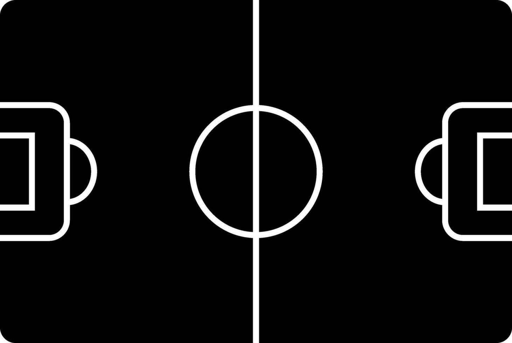

# PING PONG GAME

### Tópicos

### Descrição do Projeto: 
O jogo foi desenvolvido utilizando HTML, CSS e Canvas, permitindo uma interface interativa e visualmente atraente, que torna a experiência de jogo ainda mais envolvente.

### Descrição breve do jogo: 
O jogo é uma versão única de ping pong, onde, em vez de ter dois pads, de um lado está Lionel Messi e do outro, Cristiano Ronaldo. A bola tem o design da Bola de Ouro, simulando uma disputa emocionante entre esses dois ícones do futebol mundial. O objetivo é marcar pontos enquanto o jogador controla o Messi e o CPU o Cristiano 

### Funcionalidades:
O jogo de ping pong começa quando o jogador clica no botão "Iniciar Jogo". Nesse momento, Messi, o personagem controlado pelo jogador, entra em ação com o objetivo de não deixar o adversário marcar pontos. A partida se desenrola até que um dos jogadores consiga fazer 2 pontos, vencendo assim o jogo.

Após o término da partida, o jogador tem a opção de clicar no botão "Reiniciar Jogo", que zera os placares e reinicia a partida, permitindo jogar novamente. O placar é exibido na tela, mostrando os pontos de Messi e do adversário, e uma mensagem final informa quem foi o vencedor.
todas as funcionalidades do jogo

Para que o jogador controle Messi e defenda a bola, ele utiliza as setas para cima e para baixo, permitindo que Messi se mova verticalmente. Isso proporciona um controle dinâmico durante a partida, garantindo que o jogador possa reagir rapidamente aos ataques do adversário.

Deploy - link do projeto

### Link do projeto:
O projeto se encontra hospedado nesse [link](https://pingpong-9ncuxa42y-mateus-projects-14c1b3ca.vercel.app/) através do Vercel.app.

LINK DAS REGRAS DO MARKDOWN
https://www.markdownguide.org/basic-syntax/

